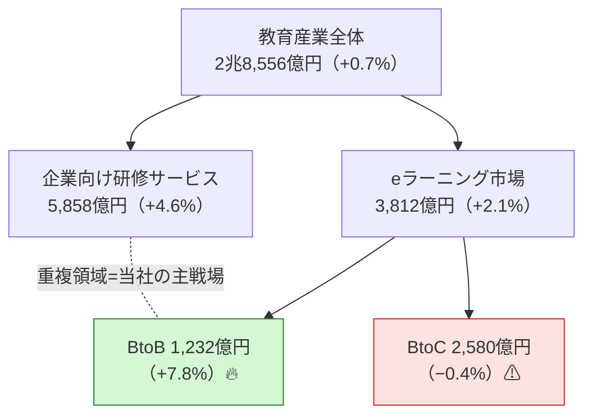
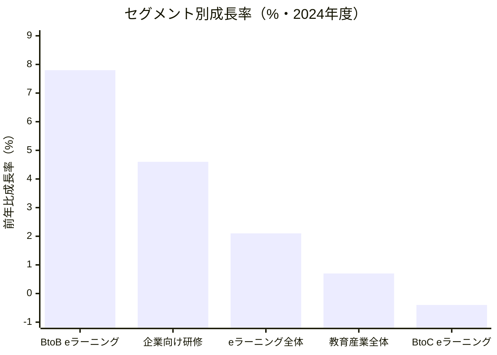
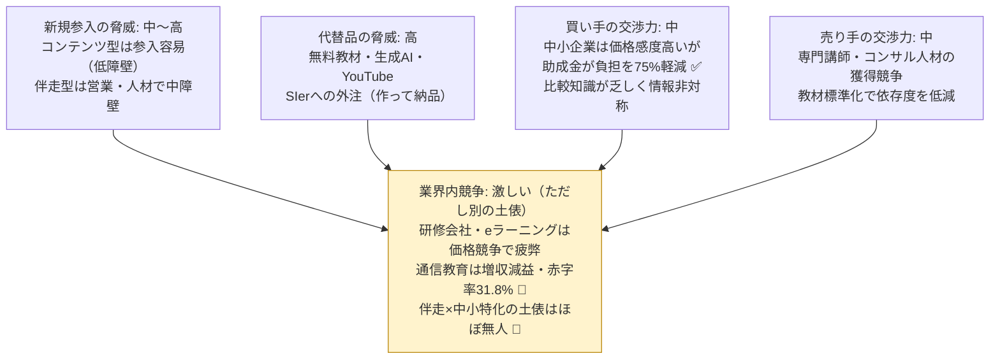
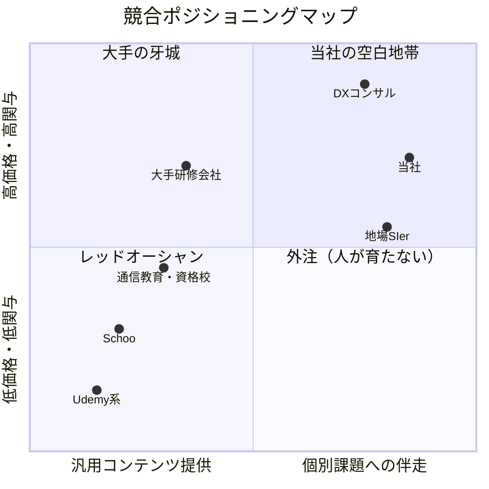
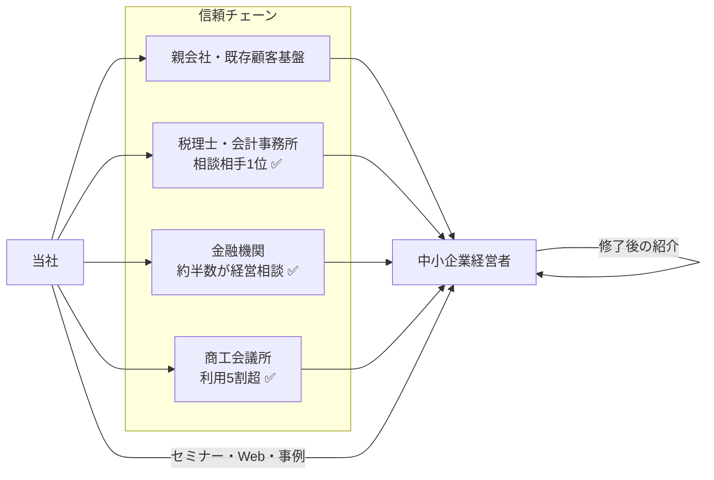

# マーケット分析 — 中小企業DXリスキリング・パートナー事業

- **作成日**: 2026-06-10
- **位置づけ**: シリーズ3本目。PEST → 5 Forces → 3C → STP → 4P → クロスSWOTの順に、マクロ環境から実行戦略へ降りる構成。数値の出典・検証状況はシリーズ既存ドキュメント（とくに `1-business-plan.md`）を参照。
- **凡例**: ✅ = 一次ソース検証済み ／ 💭 = 仮定・推論

---

## 0. エグゼクティブサマリ

教育産業全体（2.86兆円）が横ばいの中、**法人向け社会人学習だけが construct 的に成長**しており（BtoB eラーニング+7.8% ✅）、政策（助成金・給付金）が需要を人為的にブーストしている。一方で供給は「コンテンツ提供型」に偏り、成果を出す「伴走型」が空白 ✅💭。当社はこの空白を、**高関与×成果コミットの右上ポジション**で取る。4P上の核心は、Product＝研修ではなく業務改善、Price＝比較対象の置き換え（eラーニングではなくコンサル）、Place＝信頼チェーン流通、Promotion＝「旗振り役を社内で育てる」の一点突破である。

---

## 1. PEST分析（マクロ環境）

| | 機会（Opportunity） | 脅威（Threat） |
|---|---|---|
| **P: 政治・制度** | 教育訓練給付の拡充（最大80% ✅・2024/10）、教育訓練休暇給付金の新設（2025/10 ✅）、人材開発支援助成金の高率助成（経費75% ✅）— 制度が需要を直接創出 | **高率助成は2027/3で時限切れ** ✅。経産省リスキリング補助は新規参入窓口閉鎖 ✅。制度依存事業の脆弱性 |
| **E: 経済** | 構造的人手不足・賃上げ圧力 → 「省人化・生産性」への投資意欲。中小企業のDX期待支援策1位は補助金・助成金（41.6% ✅） | 教育産業全体は+0.6〜0.7%の横ばい ✅。中小企業の予算制約（DX課題3位「予算の確保が難しい」✅） |
| **S: 社会** | デジタル人材の採用難（中小の7割超が「IT人材いない」✅）→ 「育てる」への需要シフト。DX旗振り役不在が課題1位（33.8% ✅） | 「学ばない社会人」構造（自己啓発せず約8割 ✅、学んでも報われない雇用慣行 ✅）→ BtoC学習意欲には頼れない |
| **T: 技術** | 生成AI・ノーコードの成熟により「非エンジニアが業務改善を作れる」時代に → 教育対象スキルの実用性が急上昇 💭 | 同じ技術が無料・低価格の学習代替手段にもなる（生成AIに聞けば済む）→ コンテンツの価値は逓減 💭 |

**含意**: 4象限すべてが同じ方向を指す — 「コンテンツを売るな、成果が出る状態を売れ。制度はブースターであり土台にするな」。

---

## 2. 市場構造と成長セグメント

### 2-1. 市場の入れ子構造（2024年度・億円）✅

### 2-2. セグメント別成長率（前年比・2024年度）✅

**読み方**: 成長はBtoB・社会人領域に集中。当社の主戦場（企業研修×デジタル学習の重複領域）は市場全体より4〜10倍速く成長している ✅。BtoCは縮小しており、シリーズ全体で個人向け直販を第2フェーズ（給付金ルート限定）に格下げしている判断と整合。

---

## 3. 5 Forces分析（業界構造）

**構造的結論** 💭: コンテンツの土俵は5つの力すべてが不利（参入容易・代替豊富・価格比較される）。当社が選ぶ「経営コミットメント×実業務題材×成果KPI」の土俵は、(1) 代替品（無料教材・外注）が提供できない価値であり、(2) 買い手の情報非対称を成果の可視化で逆手に取り、(3) 参入障壁が営業・伴走の組織能力（模倣に時間がかかる）に置かれる。**戦略の本質は「強く戦う」ではなく「戦う場所を変える」**。

---

## 4. 3C分析

### Customer（顧客）

- 従業員30〜300名の中小・中堅企業。デジタルシフトのレベル2〜3（紙の置き換え〜社内効率化）が74%を占め ✅、レベル4（競争力化）は6.7%のみ → 伸びしろが市場の大半
- 課題は一貫して「人」: 旗振り役不在33.8% ✅・使いこなせない29.5% ✅・採用困難 ✅
- 意思決定者は経営者本人。情報源は広告ではなく税理士・金融機関・商工会議所という信頼チェーン ✅

### Competitor（競合）— 4類型

| 類型 | 代表例 | 強み | 当社が突く弱み |
|---|---|---|---|
| 大手研修会社 | インソース、リクルートMS | ブランド・講座網羅性 | 大企業向け営業構造。中小の個別業務への伴走は構造的に不採算 💭 |
| オンライン学習 | Schoo、Udemy系 | 低価格・規模 | 転移・定着に関与しない。BtoC市場自体が縮小 ✅ |
| 地場SIer・ITベンダー | — | 地域密着・実装力 | 「作って納品」で人が育たない（属人化の外部移転）|
| DXコンサル | — | 上流の構想力 | 単価が中小の予算と不整合 💭 |

### Company（自社）

既存企業の新規事業としての持ち込みアセット: 顧客基盤（CAC≈0の初期販路）、ブランドの信用（中小経営者の警戒を緩める）、財務体力（Y1赤字▲1,220万円の吸収）。欠けるもの: 教育デリバリーの実績・人材 → パイロット4社と外部講師ネットワークで補完 💭。

---

## 5. STP

### Segmentation → Targeting

| 軸 | 切り方 | ターゲット選定 |
|---|---|---|
| 企業規模 | 〜30名／30〜300名／300名〜 | **30〜300名**（决裁が速く、助成対象の「中小企業」区分 ✅、かつ受講者5名以上を出せる規模）|
| デジタル成熟度 | レベル1〜4 ✅ | **レベル2〜3**（課題を自覚し始めているが旗振り役がいない層）|
| 業種 | — | **製造・建設・卸小売・物流**（紙・属人業務が多く改善題材が豊富 💭）|
| 学習主体 | 法人経由／個人 | **法人経由を主**（BtoC縮小 ✅・「学ばない社会人」構造 ✅ のため。個人は給付金ルートのみ）|

### Positioning（知覚マップ）

**ポジショニング・ステートメント**: 「DXの旗振り役が欲しい中小企業の経営者にとって、当社は研修会社でもSIerでもなく、**社員が育ちながら業務が実際に変わる唯一のパートナー**である。なぜなら実在の業務課題を題材に、経営コミットメントと成果KPIを契約に組み込むからである。」💭

右上（高関与×伴走）にはDXコンサルが存在するが価格帯が中小と不整合であり、**中小の予算で買える高関与ポジション**が当社の空白地帯。

---

## 6. 4P（マーケティング・ミックス）

### Product（製品）

- 中核便益は「学習」ではなく「**旗振り役の社内育成＋動く業務改善2件**」。研修は手段でありアウトプットが製品
- 5商品ポートフォリオ（無償診断→①有償診断→②6ヶ月プログラム→③成果報酬→④サブスク→⑤個人向け給付講座）が顧客ジャーニーを縦断し、単発取引をLTV型へ転換
- 製品設計に「切断の修復」を内蔵: 実業務題材（転移）・就業時間内学習（時間）・スキル認定と処遇接続（報酬）— 競合のコンテンツには構造的に真似できない 💭
- 詳細: `4-product-design.md`

### Price（価格）

- **値付けの本質は比較対象の操作**: 「研修」と名乗れば1人5万円と比較され、「業務改善パートナー」と名乗れば数百万円のコンサルと比較される。②=300万円/社はコンサル比で割安、研修比で高価格 — 後者の土俵に乗らないことが価格戦略のすべて 💭
- **実質価格の二重構造**: 表面300万円 → 助成適用で実質約79万円（Y1 ✅）。「実質負担」で語ることで価格抵抗を消しつつ、表面価格＝価値のアンカーは下げない（値引きはブランド毀損、助成金は値引きではない）
- 成果報酬（③）は価格ではなく**品質シグナリング装置**: 売り手が成果にカネを賭けることで情報非対称（5 Forcesの買い手の不安）を解消する
- 価格遷移計画: Y1は助成金で実質1/4 → Y2以降はROI（削減工数20h/月≒年60万円超 💭）を価値根拠に同価格を維持。値下げで助成金消滅を埋めない

### Place（流通・チャネル）

- 直販（広告→Web→インバウンド）を主にしない。中小経営者の購買は信頼チェーン経由であり、「適切な相談相手とのつながりがない」が相談未実施理由の約半数 ✅ — 当社はチェーンの末端に「無償診断」という接続点を置く
- 物理拠点は持たない（デリバリーは顧客先・貸会議室）。Placeの資産は場所ではなく**紹介ネットワーク**

### Promotion（販促）

- コアメッセージ「**DXの旗振り役を、社内で育てる。**」— 課題1位（33.8% ✅）への直撃。禁句は「DX研修」「リスキリング講座」（Priceの土俵設計と連動）
- 施策ミックス: 自社セミナー（月1）／士業・金融機関共催／事例コンテンツ（修了ごとに資産化）／制度系SEO。Y1予算500万円 — 詳細は `5-marketing-plan.md`
- メッセージの時限設計: Y1「助成金75%は2027/3まで」✅（緊急性）→ Y2〜「事例とROI」（持続性）。販促が制度に依存したまま時限を迎えるのが本事業最大の失敗パターンであり、Q4のROI訴求テストセールスで先回りする

---

## 7. クロスSWOT（戦略の導出）

| | **S: 強み** 既存顧客基盤・ブランド／成果コミット型の商品設計／財務体力 | **W: 弱み** 教育事業の実績ゼロ／デリバリー人材未確保／知名度なし |
|---|---|---|
| **O: 機会** BtoB学習市場の成長 ✅／高率助成（〜2027/3）✅／旗振り役不在33.8% ✅／伴走型の空白 | **S×O（攻める）**: 既存顧客×助成金期限でY1に一気に14社の実績と事例を獲得。空白ポジションに最速で旗を立てる | **W×O（補う）**: パイロット4社を「実績づくり」と割り切り半額提供。外部講師ネットワークで人材を変動費化 |
| **T: 脅威** 助成金時限切れ ✅／無料教材・生成AIによる代替 💭／大手の中小参入 💭 | **S×T（守る）**: ストック収益（④⑤）比率をY3に28%へ。成果の可視化＝代替品（無料教材）が出せない証拠で防衛 | **W×T（避ける）**: コンテンツ単体販売・BtoC広告出稿には参入しない（通信教育の赤字構造 📄 の轍）。価格競争のシグナルが出たら撤退基準（転換率・Y2受注）で判断 |

---

## 8. 戦略的含意（まとめ）

1. **War（どの市場で）**: 成長しているのはBtoB社会人学習のみ ✅ — 法人経由に賭け、BtoCは恒久制度（給付金）ルートに限定する
2. **Where（どの土俵で）**: 5 Forcesが示すとおりコンテンツの土俵は構造的に負け戦。「伴走×成果×中小価格帯」の無人の土俵を選ぶ
3. **How（どう勝つか）**: 4Pを1本の論理で貫く — 製品＝業務改善、価格＝比較対象の操作、流通＝信頼チェーン、販促＝旗振り役メッセージ。どれか1つでも「研修」の文法に戻ると全体が崩れる 💭
4. **When（時間軸）**: 2027/3の助成金時限 ✅ が事業のメトロノーム。Y1は制度ブーストで実績を貯め、Y2からは事例とROIで自走する。移行の成否はY1 Q4のROI訴求テストセールスで先に判定する

---

## 関連ドキュメント

1. `1-business-plan.md` — 市場データ・制度の一次ソースと検証状況
2. `2-gap-analysis.md` — 「機能しない」構造の分析（本書の5 Forces・Productの理論的土台）
3. `4-product-design.md` — Product詳細
4. `5-marketing-plan.md` — Place・Promotion実行計画
5. `6-three-year-pl.md` — Price・数量計画の財務展開
